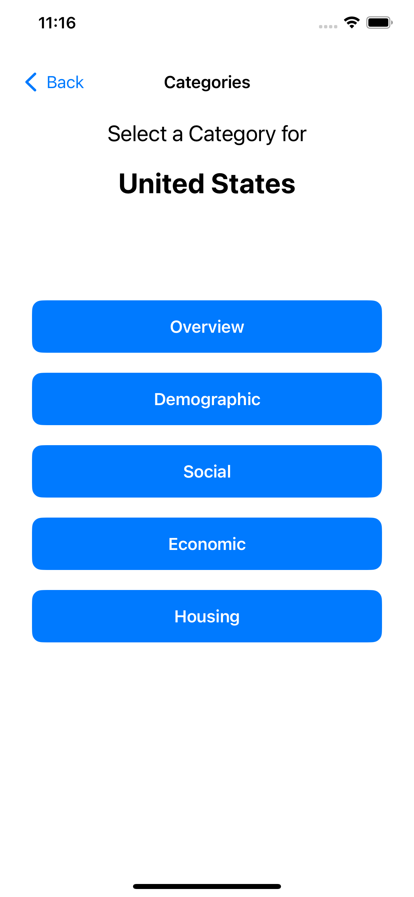
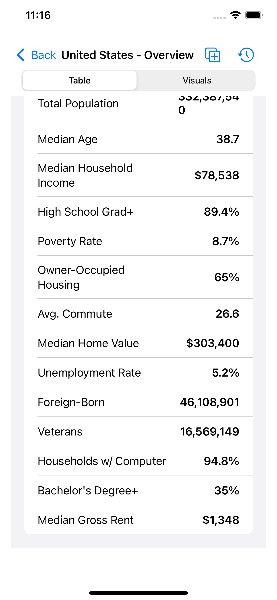
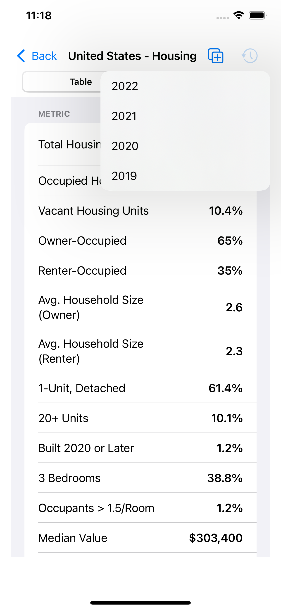
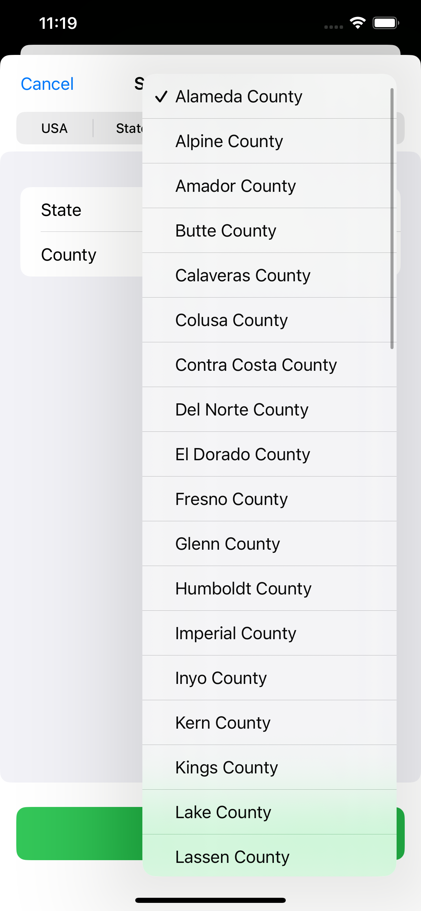
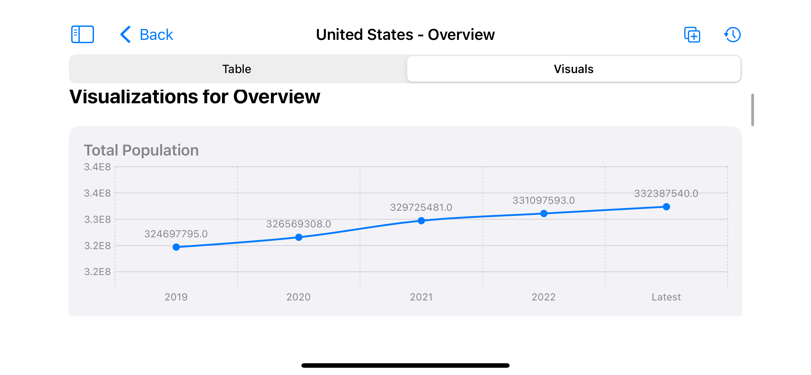
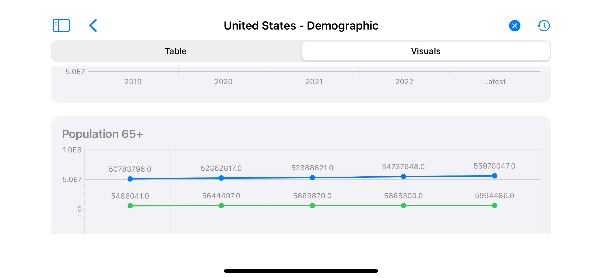

# Censusly

<p align="center">
  
</p>

<p align="center">
  <strong>Uncover the story of America, one data point at a time.</strong>
</p>

<p align="center">
  
  
  
</p>

---

**Censusly** is a powerful, beautifully designed iOS application that brings the vast database of the U.S. Census Bureau directly to your fingertips. Whether you're a student, researcher, journalist, or just a curious mind, Censusly allows you to explore, compare, and visualize complex demographic, social, and economic data with unparalleled ease.

## ✨ Key Features

* **🗺️ Multi-Level Geographic Exploration:** Dive deep into data at any level. Start with a nationwide overview and seamlessly drill down to specific states, counties, cities, and even zip codes.
* **📊 Rich Data Categories:** Go beyond simple population counts. Explore a curated selection of metrics across five essential categories: **Overview**, **Demographic**, **Social**, **Economic**, and **Housing**.
* **⚖️ Powerful Comparison Engine:** Wondering how your city stacks up against another? Our intuitive comparison tool lets you view data for two different locations side-by-side, revealing fascinating insights and contrasts.
* **📈 Historical Data & Trends:** Journey back in time. Censusly allows you to pull data from previous years, making it easy to track trends and understand the evolution of a community over time.
* **🎨 Stunning Visualizations:** Don't just read the data—see it. Switch to our visualization mode to view metrics as dynamic line charts and informative gauges, turning raw numbers into compelling visual stories.

## Screentshots

<table>
  <tr>
    <td width="50%" align="center">
      <b>See Census data points across various categories</b><br>
      
    </td>
    <td width="50%" align="center">
      <b>Delve into a sepcific category</b><br>
      
    </td>
  </tr>
  <tr>
    <td width="50%" align="center">
      <b>Compare across past years</b><br>
      
    </td>
    <td width="50%" align="center">
      <b>Compare between any two cities/counties/state in US</b><br>
      
    </td>
  </tr>
  <tr>
    <td width="50%" align="center">
      <b>See the trend visually</b><br>
      
    </td>
    <td width="50%" align="center">
      <b>Compare the trend visually</b><br>
      
    </td>
  </tr>

</table>


## 🚀 Getting Started

This repository contains the full source code for the Censusly iOS application. To build and run the project on your local machine, follow these simple steps:

1.  **Prerequisites:**
    * macOS with the latest version of Xcode installed.
    * An active Apple Developer account (for running on a physical device).

2.  **Clone the Repository:**
    ```bash
    git clone [https://github.com/vibecoderx/Censusly.git](https://github.com/vibecoderx/Censusly.git)
    cd Censusly/ios
    ```

3.  **Open in Xcode:**
    * Open the `Censusly.xcodeproj` file in Xcode.
    * Select your target simulator or device.
    * Press `Cmd + R` to build and run the application.

## 🛠️ Technical Deep Dive

Censusly is built with modern iOS technologies and follows best practices for a scalable and maintainable codebase.

* **Technology Stack:** Built entirely with **Swift** and **SwiftUI**, leveraging the latest features for a declarative and responsive user interface.
* **Architecture:** The app is structured using the **Model-View-ViewModel (MVVM)** architectural pattern, ensuring a clean separation of concerns between the data logic, presentation logic, and UI.
* **API Integration:** Data is fetched in real-time from the official **U.S. Census Bureau's American Community Survey (ACS) 5-Year Data Profile API**. This ensures the data is reliable, comprehensive, and up-to-date.

### Project Structure

The codebase is organized into logical folders to make navigation and contributions straightforward:

* **`/Models`**: Contains the Swift `structs` that model the data returned from the Census API (e.g., `OverviewData`, `DemographicData`).
* **`/ViewModels`**: Holds the business logic and state management classes that power the views (e.g., `SelectionViewModel`, `DataDisplayViewModel`).
* **`/Views`**: Contains all the SwiftUI views that make up the user interface, from the main selection screen to the detailed data tables and visualizations.
* **`/Services`**: Includes the `CensusAPIService` class responsible for all network requests to the Census Bureau API.
* **`/Helpers`**: A collection of utility classes and extensions, such as the `StateAbbreviationHelper`.

## 🤝 Contributing

Contributions are welcome! Whether you have a feature request, bug report, or a pull request, please feel free to open an issue or submit a PR.

## 📄 License

This project is licensed under the MIT License. See the `LICENSE` file for more details.

## 🙏 Acknowledgments

This application would not be possible without the incredible public data provided by the **U.S. Census Bureau**. All data is sourced directly from their official APIs.

---


> ### **A Note on How This App Was Built**
>     
> A significant portion of the code in this repository was generated with the assistance of a large language model (LLM). This project was largely **"vibe-coded,"** meaning it was developed through a rapid, iterative, and conversational process with a GenAI tool with minimal review of the generated code. Correctness of the code was checked at certain core places (e.g., using the correct API endpoints, etc). Overall app correctness check was done via manual testing of various UI workflows.

---
